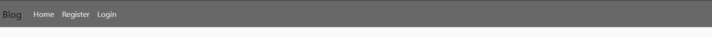
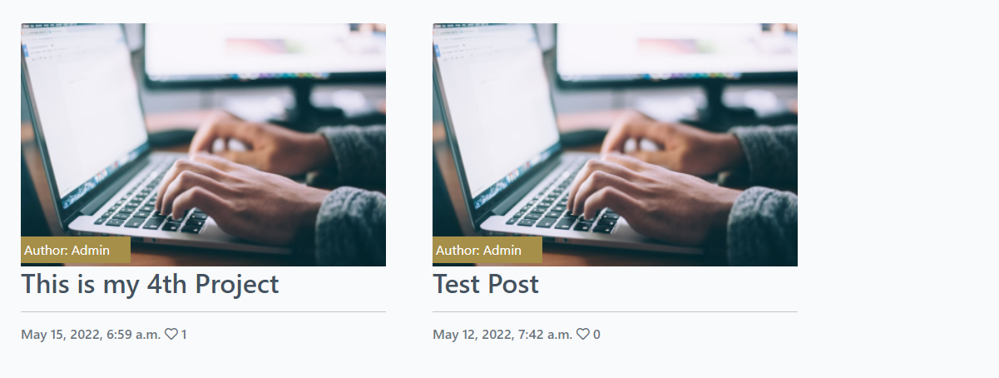
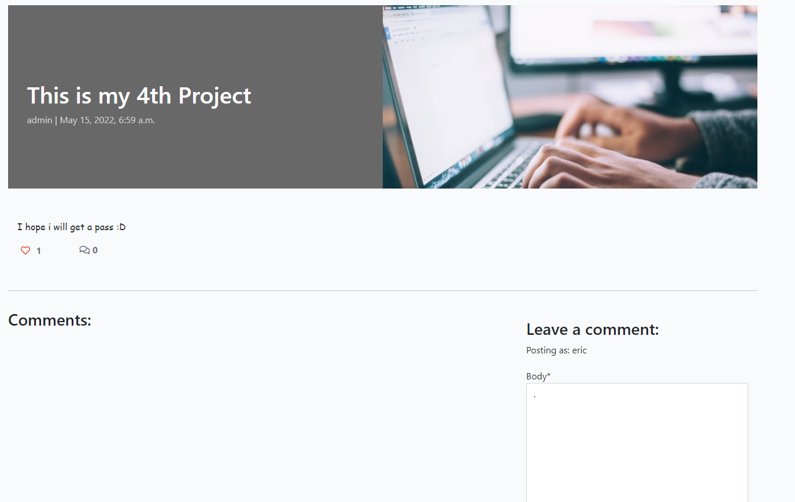
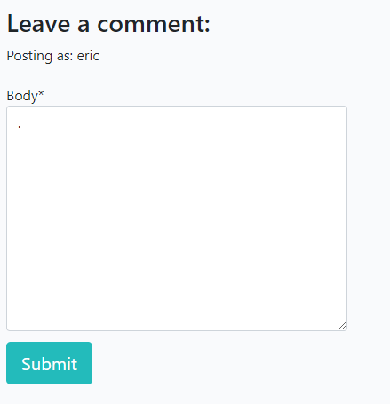

# Blog

Welcome to this simple blog where you can view different posts, register on the website so you can comment and like different posts.

## Features

### Existing features

- Navigation bar 
   - In the navigation bar you have the option to register/login on the website so that you can like and comment on different posts.

   
- Posts section
   - Here you can see every post that the admins have created

- View a post
   - Then when you click on a post it takes you to that post page 

   

- Like feature
   - Here you have the option to leave a like on any post you want

   

- Leave a comment on the post
   - Here you can comment on the post

   

## Testing
- I tested that this page works in different browsers: Opera, Chrome, Microsoft Edge
- I confirmed that this project is responsive. looks good and functions on all standard screen sizes using the devtools device toolbar.

### Validator test

- CSS
   - No errors were returned when passing through the official (Jigsaw) validator

## Deployment

- The site was deployed to GitHub pages. The steps to deploy are as follows: 
    
    - Log in to GitHub and locate the GitHub Repository
    
    - At the top of the Repository (not top of page), locate the "Settings" Button on the menu.

    - Scroll down the Settings page until you locate the "GitHub Pages" Section.

    - Under "Source", click the dropdown called "None" and select "Master Branch".

    - Once the master branch has been selected, the page will be automatically refreshed with a detailed ribbon display to indicate the successful deployment. 
## Credits

### Media

- The icons were taken from [Font Awesome](https://fontawesome.com/)

- [Bootstrap](https://getbootstrap.com/)

- The posts image is from [Unsplash](https://unsplash.com/s/photos/blog)